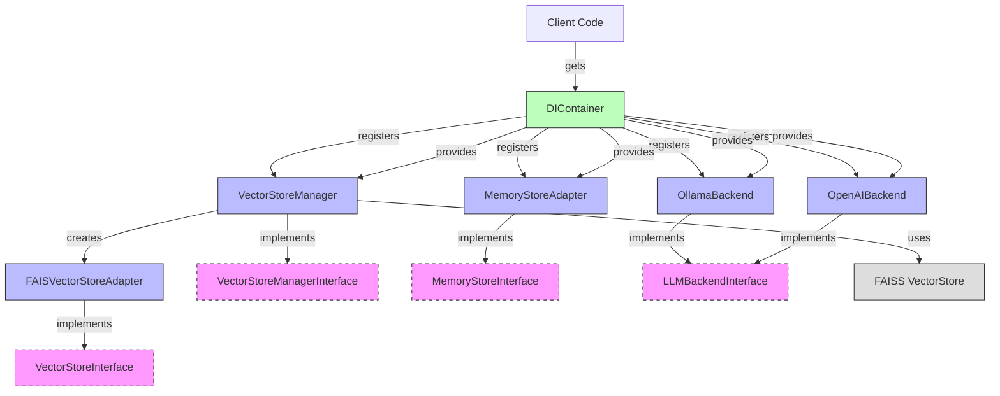

# Suhana Architecture

This document provides an overview of the Suhana architecture, focusing on the relationships between the Dependency Injection Container (DIContainer), VectorStore Manager, Memory Stores, and LLM backends.

## Component Relationships

The following diagram illustrates the relationships between the key components of the Suhana architecture:



## Component Descriptions

### DIContainer

The Dependency Injection Container (DIContainer) is a central registry for all components in the Suhana application. It provides:

- Registration of service instances and factories
- Retrieval of services by name
- Type checking for dependencies
- Support for testing by allowing dependencies to be mocked

### VectorStoreManager

The VectorStoreManager implements the VectorStoreManagerInterface and is responsible for:

- Managing the vectorstore state
- Loading and initializing the appropriate vectorstore based on the user profile
- Providing access to the vectorstore for similarity searches

### MemoryStoreAdapter

The MemoryStoreAdapter implements the MemoryStoreInterface and is responsible for:

- Searching through the user's memory for relevant information
- Adapting the memory search function to the MemoryStoreInterface

### LLM Backends

The LLM backends (OllamaBackend and OpenAIBackend) implement the LLMBackendInterface and are responsible for:

- Processing user input and system prompts
- Managing conversation history
- Communicating with the respective LLM APIs
- Supporting both streaming and non-streaming responses

### FAISVectorStoreAdapter

The FAISVectorStoreAdapter implements the VectorStoreInterface and is responsible for:

- Adapting the FAISS vectorstore to the VectorStoreInterface
- Providing similarity search functionality with scores

## Interaction Flow

1. The DIContainer registers all components during application initialization
2. Client code retrieves components from the DIContainer as needed
3. The VectorStoreManager creates and manages the FAISVectorStoreAdapter
4. The MemoryStoreAdapter provides access to the user's memory
5. The LLM backends process user input and generate responses

## Interface Definitions

### VectorStoreManagerInterface

```python
class VectorStoreManagerInterface(ABC):
    @property
    @abstractmethod
    def current_vector_mode(self) -> Optional[str]:
        """Get the current vector mode."""
        pass

    @abstractmethod
    def get_vectorstore(self, profile: Optional[Dict[str, Any]] = None) -> Optional[VectorStoreInterface]:
        """Get the appropriate vectorstore based on the profile and mode."""
        pass

    @abstractmethod
    def reset_vectorstore(self) -> None:
        """Reset the vectorstore, forcing it to be reloaded on the next get_vectorstore call."""
        pass
```

### VectorStoreInterface

```python
class VectorStoreInterface(ABC):
    @abstractmethod
    def similarity_search_with_score(self, query: str, k: int = 4) -> List[tuple]:
        """Search for similar documents with scores."""
        pass
```

### MemoryStoreInterface

```python
class MemoryStoreInterface(ABC):
    @abstractmethod
    def search_memory(self, query: str, k: int = 10) -> List[Any]:
        """Search for relevant memories."""
        pass
```

### LLMBackendInterface

```python
class LLMBackendInterface(ABC):
    @abstractmethod
    def query(
        self,
        user_input: str,
        system_prompt: str,
        profile: Dict[str, Any],
        settings: Dict[str, Any],
        force_stream: bool = False
    ) -> Union[str, Generator[str, None, None]]:
        """Query the LLM backend."""
        pass
```
